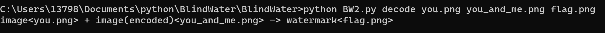
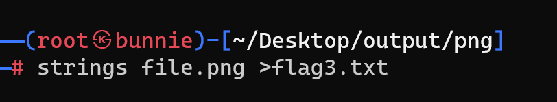

# ctf
for fun!


## misc

### 编码分析

工具:    
[进制转化](https://www.sojson.com/hexconvert.html)    
[摩尔斯电码](http://www.zhongguosou.com/zonghe/moErSiCodeConverter.aspx)    
[Ascll](https://www.asciim.cn/m/tools/convert_ascii_to_string.html)    
[base64 base32 base16](https://www.qqxiuzi.cn/bianma/base64.htm)    
(标志：base会出现=进行补位)    
[xxencoding](http://web.chacuo.net/charsetxxencode)    
(标志：会出现+ -号)     
[URL](http://web.chacuo.net/charseturlencode)    
(出现大量百分号)    
[unicode](https://c.runoob.com/front-end/3602/)   
[零宽unicode](https://330k.github.io/misc_tools/unicode_steganography.html)   
[条形码](https://online-barcode-reader.inliteresearch.com/)    
[二维码](https://merri.cx/qrazybox/)


### 隐写技术

工具：   
1. [盲水印：下载WaterMark.exe](https://url61.ctfile.com/f/tempdir-VzdRZAE3WjpUZVEwVGMHZAItADkFPFxkXT5ZPQ5tADsKaQQ3Ai1bMlVgBGNSZgNoBjVTagI0CjoAbQ](https://www.mefcl.com/watermark/5821))
2. 有两张图片的盲水印：用cmd运行脚本
3. 查找和显示二进制文件中的文本字符串：kali linux的strings
4. 反转颜色：用010打开发现png文件头文件尾都与标准格式不同，考虑运行反转颜色的脚本。
```

f1 = open("./misc5.5.png", "rb")
f2 = open("./output.png", "wb")
all_data = f1.read()
lt = []

for i in all_data:
    if i == 0:
        lt.append(i)//这里不能用0x100相减，否则会溢出
    else:
        lt.append(0x100 - i)

f2.write(bytes(lt))
f1.close()
f2.close()


```


***

## web
1. 路径发现————dirsearch     
简单使用：(kali)
```
dirsearch -u https://target

```
```
dirsearch -e php,html,js -u https://target

```
```
dirsearch -e php,html,js -u https://target -w /path/to/wordlist

```


